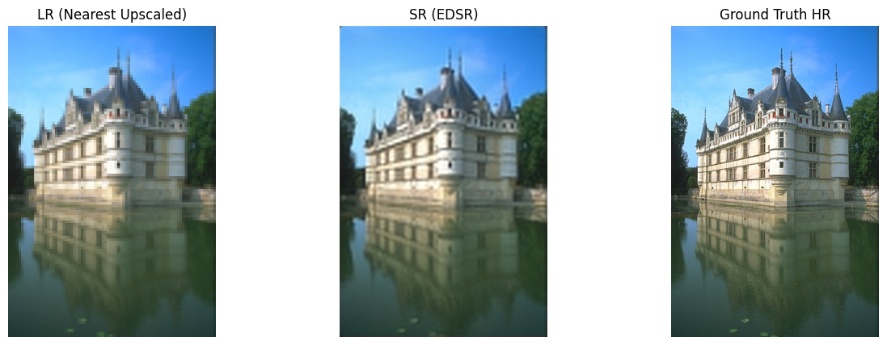
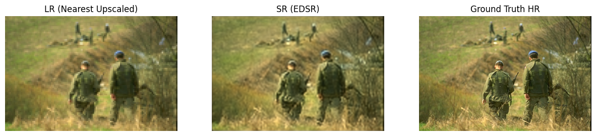
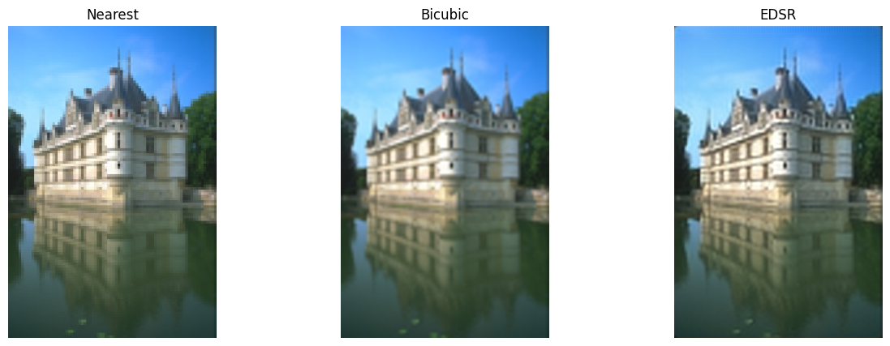
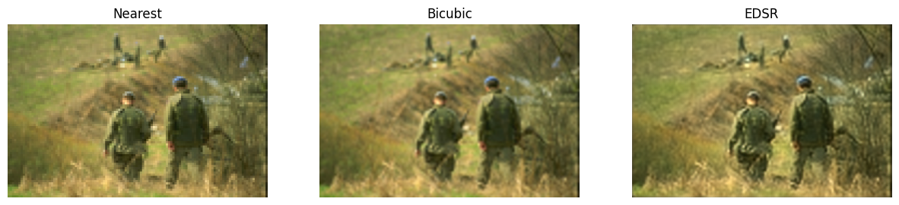

## Image Super-Resolution (4×) with EDSR

<!--
A full-stack web application that processes video lectures, generates text transcripts, and automatically creates multiple-choice questions (MCQs) for each segment. The app features a modern, polished interface and demonstrates core MVP functionality.
-->

### Overview

This repository contains a PyTorch implementation of the Enhanced Deep Super-Resolution Network (EDSR) for 4× image super-resolution. The goal is to take low-resolution (LR) images and generate high-resolution (HR) counterparts that closely match the ground truth, improving visual detail and facilitating downstream vision tasks.

---

## Features
- **EDSR Model**: 16 residual blocks with skip connections and PixelShuffle upsampling  
- **Training Pipeline**:  
  - L1 (MAE) loss  
  - Adam optimizer with ReduceLROnPlateau scheduler  
  - Data augmentation (random crops, flips)  
- **Evaluation Metrics**: PSNR & SSIM, with automated resizing to ensure matching dimensions  
- **Visualization**:  
  - Side-by-side comparisons of Nearest, Bicubic, and EDSR outputs  
  - Quantitative PSNR/SSIM annotations per sample  
- **Batch Inference**: Export all 4× upscaled images (Nearest, Bicubic, EDSR) for downstream use


- **Preprocessing**  
- Normalize to [0,1]  
- Random HR crops of size 192×192, corresponding LR patches of 48×48  
- Center-crop for evaluation  

## Architecture
```text
Input (C×48×48)
 │
Conv(3×3) → 64-feature maps
 │
16 × [ResidualBlock(64) → skip-add]
 │
Conv(3×3) + entry-skip
 │
4× Upsampling via 2 × [Conv(3×3) → PixelShuffle(2) → ReLU]
 │
Conv(3×3) → 3-channel RGB output (C×192×192)

```


### Results :

    
    Average Test PSNR: 25.92 dB
    Average Test SSIM: 0.6720


    | Method   | PSNR (dB) | SSIM      |
    | -------- | --------- | --------- |
    | Nearest  | 22.14     | 0.512     |
    | Bicubic  | 24.07     | 0.603     |
    | **EDSR** | **25.92** | **0.672** |


  


#### LR(Nearest Upscaled) vs SR(EDSR) vs Ground Truth(HR) comparison 

  
  

 #### Nearest vs Bicubic vs EDSR comparison

  
  


## Future Work

- Incorporate perceptual or adversarial loss (SRGAN) for even sharper details

- Explore channel-attention (RCAN) or transformer-based SR models

- Extend to video super-resolution


    
